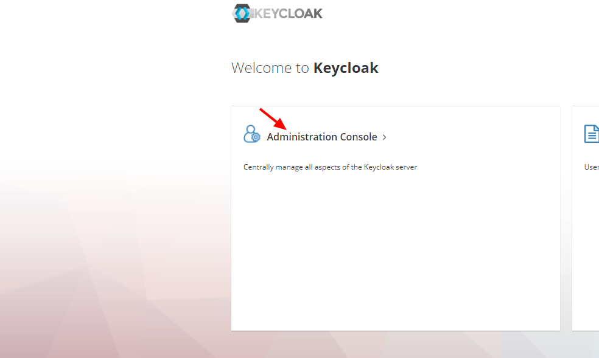
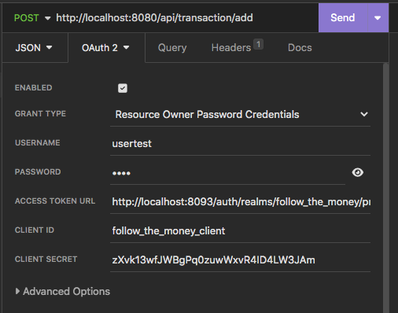

# O problema

Um comerciante precisa controlar o seu fluxo de caixa diário com os lançamentos (débitos e créditos), também precisa de um relatório que disponibilize o saldo diário consolidado.

# Requisitos de negócio

- Serviço que faça o controle de lançamentos
- Serviço do consolidado diário
  
# Desenho da Solução

Para o diagrama da solução foi adotado o padrão C4 Model, a documentação do mesmo pode ser encontrada [aqui](https://c4model.com/).

## Contexto de Sistema - C4 Nível 1

## Container -  C4 Nível 2

# Padrões e boas práticas adotadas

- Observability ([Opentelemetry](https://opentelemetry.io) + [jaegertracing](https://www.jaegertracing.io), [Serilog](https://serilog.net) + [Elasticsearch](https://www.elastic.co/pt/what-is/elasticsearch))
- Oauth 2.0
- Arquitetura Exagonal (Port and adapters)
- SOLID
- Repository Pattern
- Mediator
- Domain Notification
- Domain Events
- BDD (Behavior Driven Development - [Specflow](https://specflow.org))

Detalhes sobre os padrões e boas práticas descritos acima podem ser consultados clicando [aqui](https://refactoring.guru/pt-br).

# Dpendências para rodar o projeto

- Docker version 23.0.1-rd, build 393499b
- Docker Compose version v2.16.0

# Run - Visual Studio

- Selecione o projeto docker-compose como projeto principal
- Clique no icone para rodar o projeto

# Run - Docker

Após clonar o repositório certifique-se de que esteja na pasta raiz do mesmo e então rode o seguinte comando

>docker-compose up

Isso pode levar uns minutos...

## Configurando o provedor de autenticação

Acesse:
> <http://localhost:8093/auth/>

> Usuário: admin

>Senha: Pa55w0rd

E clique no link como indicado na imagem

### Criando um Realm

### Criando um Client

**Copie o Client ID**

**Copie o Client Secret**

### Criando um usuário

# Executanto os endpoints

## CURL

Authenticação
> curl --request POST \
  --url '<http://localhost:8093/auth/realms/follow_the_money/protocol/openid-connect/token>' \
  --header 'content-type: application/x-www-form-urlencoded' \
  --data grant_type=password \
  --data 'username=usertest' \
  --data 'password=1234' \
  --data 'client_id=follow_the_money_client' \
  --data 'client_secret={yourClientSecret}'

Get Consolidate
> curl --request GET \
  --url '<http://localhost:8080/api/consolidate?Date=06%2F15%2F2023>' \
  --header 'Authorization:Bearer {access_token}'

Create Transaction
> curl -v --request POST \
 --url '<http://localhost:8080/api/transaction/add>' \
 --header 'Authorization: Bearer {access_token}' \
 --header  "Content-type: application/json" \
 -d '{"description": "Entrada","value": 670,  "type": 0}'

## Insomnia

Aqui você encontrará uma collection para rodar com o programa Insomnia:

# Nota
>
> Não esqueça de configurar a autenticação oauth 2 como na foto abaixo:
> 

Abaixo segue os links dos serviços de monitoramento e observabilidade:

- [Consolidate.Api - Health Check](http://localhost:8081/_health-metrics)

><http://localhost:8081/_health-metrics>

- [Transactions.Api - Health Check](http://localhost:8082/_health-metrics)

><http://localhost:8082/_health-metrics>

- [Jaeger](http://localhost:16686/search)

><http://localhost:16686/search>

- [Elasticsearch](http://localhost:5601/app/home#/)

><http://localhost:5601/app/home#/>
  
## Observação

### Datas

Os valores de datas utilizados devem seguir o seguinte formato:
> MM/dd/yyyy

### Elasticksearch

Para visualização dos logos os indices dos mesmos devem ser criados como na imagem abaixo:

